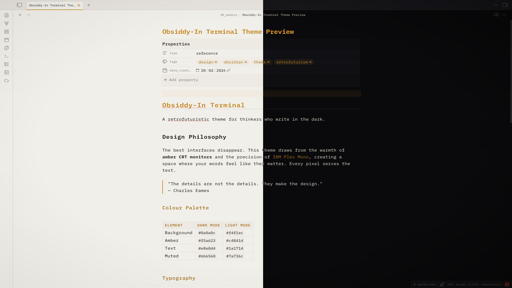

# Obsiddy-In Terminal

A retrofuturistic Obsidian theme. Amber on dark. IBM Plex Mono. CRT warmth.

---

## About

This theme is the companion to [Obsiddy In](https://github.com/leonjacobs-collab/obsiddy-in) — a browser-based homepage for your Obsidian vault that lets you capture notes and rediscover your existing knowledge. The Terminal style in Obsiddy In and this theme share the same design language: amber accents, monospace typography, and a warm retrofuturistic aesthetic inspired by CRT monitors.

Use them together for a seamless experience from browser to vault.

## Features

- **Dark and light modes** with warm, considered palettes
- **IBM Plex Mono** typography throughout
- **CRT scanline overlay** and vignette effect (disabled on mobile)
- **Amber accent system** across headings, tags, links, buttons, and graph view
- Custom styling for blockquotes, code blocks, tables, callouts, and properties

## Installation

Available from **Settings > Appearance > Themes** in Obsidian. Search for "Obsiddy-In Terminal".

Or manually: download `manifest.json` and `theme.css` into `.obsidian/themes/Obsiddy-In Terminal/` in your vault.

## License

MIT — do whatever you want with it.
